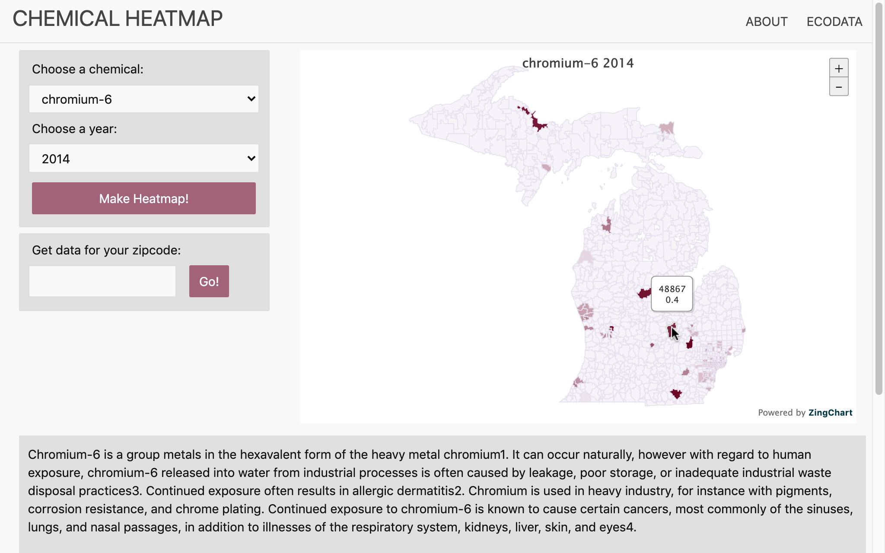

### A website to easily let users view heatmaps of the contamination levels of various hazardous chemicals across the state of Michigan. Try it out at https://dhanujg.github.io/chem_heatmap.github.io/!

The data for this website was obtained by gathering and analyzing 400,000+ publicly available unstructured EPA datapoints.
